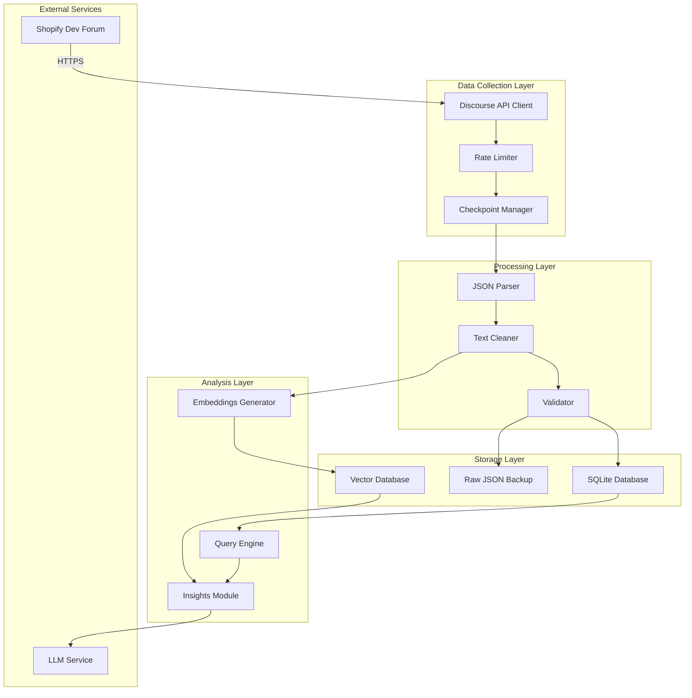
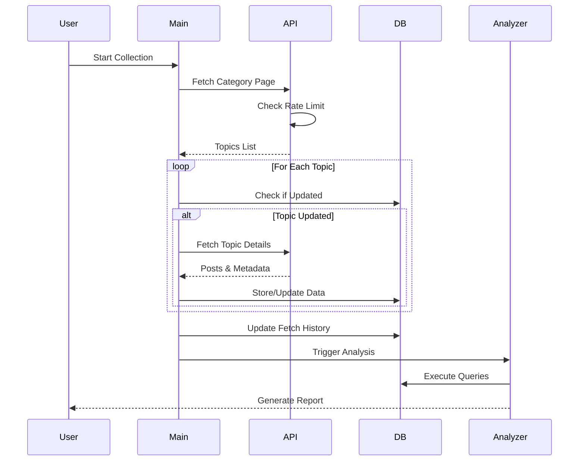
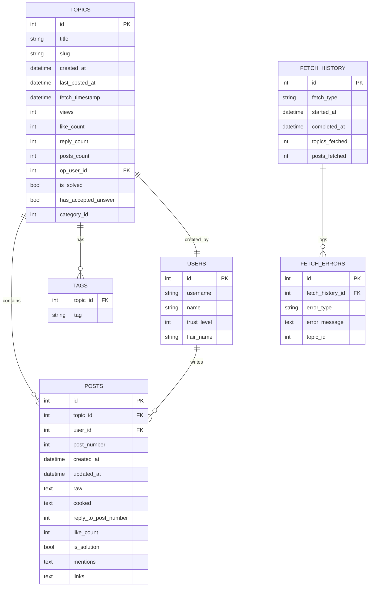
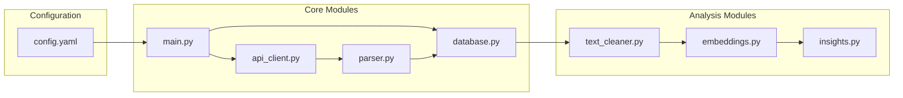
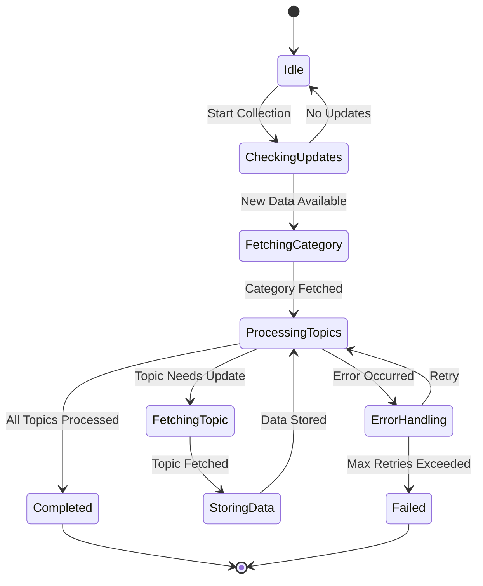
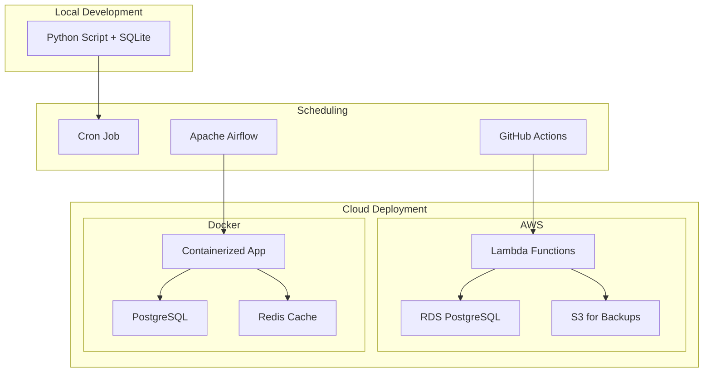

# Shopify Forum Analyzer - System Architecture

## High-Level Architecture



## Data Flow Sequence



## Database Schema (Enhanced)



## Component Interactions



## State Machine for Data Collection



## Deployment Options



## Performance Metrics Dashboard

```mermaid
graph LR
    subgraph "Collection Metrics"
        TPM[Topics/Minute]
        PPM[Posts/Minute]
        ER[Error Rate]
    end
    
    subgraph "Storage Metrics"
        DS[Database Size]
        QT[Query Time]
        CC[Cache Hits]
    end
    
    subgraph "Analysis Metrics"
        EP[Embeddings Processed]
        IQ[Insights Generated]
        AT[Analysis Time]
    end
    
    subgraph "Dashboard"
        GRAF[Grafana]
        PROM[Prometheus]
    end
    
    TPM --> PROM
    PPM --> PROM
    ER --> PROM
    DS --> PROM
    QT --> PROM
    CC --> PROM
    EP --> PROM
    IQ --> PROM
    AT --> PROM
    PROM --> GRAF