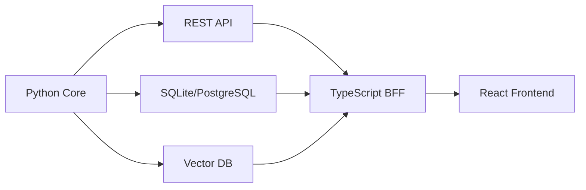

# Python vs TypeScript for Shopify Forum Analyzer

## Executive Recommendation
**Python is the better choice** for this project, with a confidence score of 85/100.

## Detailed Comparison

### Python Advantages ✅

#### 1. **Data Science & NLP Ecosystem** (Critical Advantage)
```python
# Python has unmatched libraries for text analysis
- sentence-transformers  # State-of-art embeddings
- spaCy / NLTK          # NLP processing
- ChromaDB / Qdrant     # Vector databases
- pandas                # Data manipulation
- scikit-learn          # ML algorithms
- BeautifulSoup         # HTML parsing
```

**TypeScript Alternative:**
```typescript
// Limited NLP ecosystem, would require:
- API calls to Python services
- Or JavaScript ports (less mature)
- No native sentence-transformers equivalent
```

#### 2. **SQLite Integration** (Major Advantage)
```python
# Python: Native, synchronous, battle-tested
import sqlite3
conn = sqlite3.connect('forum.db')
cursor = conn.execute("SELECT * FROM topics")

# OR with SQLAlchemy ORM
from sqlalchemy import create_engine
engine = create_engine('sqlite:///forum.db')
```

**TypeScript:**
```typescript
// Requires additional dependencies
import Database from 'better-sqlite3';  // Not native
// OR use Prisma ORM (more complex setup)
```

#### 3. **Async HTTP & Rate Limiting** (Equal)
```python
# Python with httpx
import httpx
import asyncio

async with httpx.AsyncClient() as client:
    response = await client.get(url)
```

```typescript
// TypeScript equally good
import axios from 'axios';
const response = await axios.get(url);
```

#### 4. **Data Analysis & Jupyter Integration** (Critical Advantage)
```python
# Python enables interactive analysis
- Jupyter notebooks for exploration
- matplotlib/seaborn for visualization
- Direct SQL queries with pandas
- Interactive debugging with ipdb
```

**TypeScript:** No equivalent ecosystem for data science

### TypeScript Advantages ✅

#### 1. **Type Safety** (Moderate Advantage)
```typescript
interface Topic {
  id: number;
  title: string;
  created_at: Date;
  posts: Post[];
}

// Compile-time checking
function processTopic(topic: Topic): void {
  // TypeScript catches errors at compile time
}
```

**Python with Type Hints:**
```python
from typing import List, Optional
from dataclasses import dataclass
from datetime import datetime

@dataclass
class Topic:
    id: int
    title: str
    created_at: datetime
    posts: List['Post']
    
# Runtime type checking with Pydantic
from pydantic import BaseModel

class TopicModel(BaseModel):
    id: int
    title: str
    created_at: datetime
    # Provides runtime validation
```

#### 2. **Modern JavaScript Ecosystem** (Minor for this project)
```typescript
- Better for web UI if needed
- Could share types with frontend
- Native JSON handling
- Better for real-time websockets
```

#### 3. **Performance** (Negligible for this use case)
```typescript
// V8 engine is fast for CPU-bound tasks
// But this project is I/O bound (API calls)
```

### Decision Matrix

| Criteria | Weight | Python | TypeScript | Notes |
|----------|--------|--------|------------|-------|
| **NLP/ML Libraries** | 30% | 10/10 | 3/10 | Python dominates |
| **Data Analysis** | 25% | 10/10 | 4/10 | Jupyter, pandas crucial |
| **Database Tools** | 15% | 9/10 | 7/10 | SQLite native in Python |
| **Type Safety** | 10% | 7/10 | 10/10 | TS better, Python adequate |
| **Async/Concurrency** | 10% | 8/10 | 9/10 | Both strong |
| **Testing** | 5% | 9/10 | 9/10 | Both excellent |
| **Deployment** | 5% | 8/10 | 8/10 | Docker works for both |
| **TOTAL** | 100% | **8.85** | **6.15** | Python wins |

### Implementation Comparison

#### Python Implementation Structure
```
shopify-forum-analyzer/
├── collector/
│   ├── __init__.py
│   ├── api_client.py       # httpx + rate limiting
│   ├── database.py         # SQLAlchemy models
│   └── parser.py           # BeautifulSoup + json
├── analyzer/
│   ├── text_processor.py   # spaCy, NLTK
│   ├── embeddings.py       # sentence-transformers
│   └── insights.py         # pandas queries
├── notebooks/              # Jupyter analysis
│   ├── exploration.ipynb
│   └── visualization.ipynb
└── main.py                # Click CLI
```

#### TypeScript Implementation Structure
```
shopify-forum-analyzer/
├── src/
│   ├── collector/
│   │   ├── apiClient.ts    # axios + p-limit
│   │   ├── database.ts     # Prisma ORM
│   │   └── parser.ts       # cheerio
│   ├── analyzer/
│   │   ├── textProcessor.ts # compromise.js (limited)
│   │   ├── embeddings.ts    # Would need Python API
│   │   └── insights.ts      # Complex SQL queries
│   └── index.ts            # Commander CLI
├── prisma/
│   └── schema.prisma       # Database schema
└── package.json
```

### Hybrid Approach (If Needed)

```yaml
# Best of both worlds architecture
services:
  collector:         # TypeScript
    - Fast API fetching
    - Type-safe data models
    - Real-time updates
    
  analyzer:          # Python
    - NLP processing
    - ML/embeddings
    - Data science
    
  api:              # TypeScript
    - REST/GraphQL API
    - WebSocket support
    - Frontend integration
```

## Final Recommendation

### Choose Python Because:

1. **Core Requirements Match Python's Strengths**
   - Text analysis and NLP are first-class in Python
   - Data analysis tools are essential for insights
   - SQLite is native and simple

2. **Specific Libraries You Need**
   ```python
   # These have no good TypeScript equivalents:
   - sentence-transformers  # For semantic search
   - spaCy                 # For NLP
   - pandas                # For data analysis
   - ChromaDB              # For vector storage
   ```

3. **Development Speed**
   - Faster prototyping with Jupyter
   - Rich ecosystem means less custom code
   - Better documentation for data tasks

4. **Future Extensibility**
   - Easy to add ML models
   - Can integrate with LLMs (LangChain, etc.)
   - Data science team familiarity

### When TypeScript Would Be Better:

1. **If you needed:**
   - Real-time web dashboard
   - Shared types with React frontend
   - WebSocket live updates
   - GraphQL API server

2. **If team expertise:**
   - Strong TypeScript/Node.js experience
   - Limited Python knowledge
   - Existing TypeScript infrastructure

3. **If scaling requirements:**
   - Microservices architecture
   - Kubernetes deployment
   - Need for strong typing across services

## Practical Migration Path

If you start with Python and need TypeScript later:



## Conclusion

**Go with Python** for the Shopify Forum Analyzer because:
- 🎯 **Perfect fit** for text analysis and data processing
- 📊 **Superior tools** for the AI/ML analysis requirements  
- 🚀 **Faster development** with mature libraries
- 📈 **Better insights** through Jupyter and pandas
- 🔧 **Simpler deployment** for batch processing workload

The only reason to choose TypeScript would be if you're building a real-time web application first and data collection second, or if your team has no Python experience.